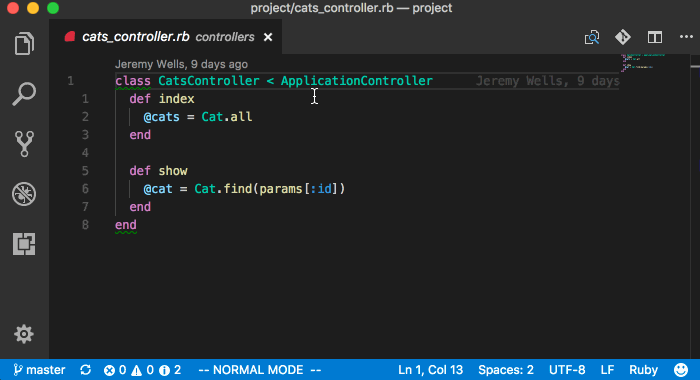

# Rails Fast Nav [](https://travis-ci.org/jemmyw/vscode-rails-fast-nav)

Commands to move between files in a Rails application.

## Features

- Navigate to all known files (alt+r) [command.railsFastNavigation]
- Switch to model [command.railsFastSwitchToModel]
- Switch to controller [command.railsSwitchToController]
- Switch to view [command.railsFastSwitchToView]
- Switch to test/spec [command.railsFastSwitchToTest] + alias [command.railsFastSwitchToSpec]
- Switch to fixture [command.railsFastSwitchToFixture]
- Create View [command.railsCreateView]
- Create Spec [command.railsCreateSpec]

## Screenshot



## Configuration

Set the Rails `app` directory if you have a non-standard directory layout:

```json
"rails.appDir": "lib/app"
```

Change the default view extension from `html.erb`:

```json
"rails.viewFileExtension": "json.jbuilder"
```
