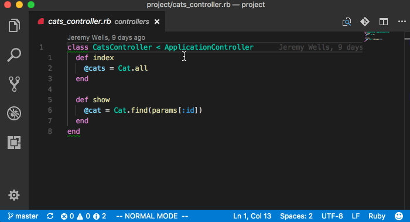

# Rails Fast Nav 
  
Commands to move between files in a Rails application.

## Features

- Navigate to all known files (alt+r) [command.railsFastNavigation]
- Switch to model [command.railsFastSwitchToModel]
- Switch to controller [command.railsSwitchToController]
- Switch to view [command.railsFastSwitchToView]
- Switch to test/spec [command.railsFastSwitchToTest] + alias [command.railsFastSwitchToSpec]
- Switch to fixture [command.railsFastSwitchToFixture]
- Create View [command.railsCreateView]
- Create Spec [command.railsCreateSpec]

## Screenshot



## Configuration

Set the Rails `app` directory if you have a non-standard directory layout:

```json
"rails.appDir": "lib/app"
```

Change the default view extension from `html.erb`:

```json
"rails.viewFileExtension": "json.jbuilder"
```

### Multiple app roots (Packwerk, Rails engines)

For repositories with several `app` directories (Packwerk packs, Rails engines, or custom components), set `rails.appDirs` to glob patterns relative to the Rails root. When `rails.appDirs` is empty or omitted, only `rails.appDir` is used (default `app`).

```json
"rails.appDirs": ["app", "packs/*/app", "engines/*/app"]
```

Navigation picks the **longest matching** app root for the current file, so files under `packs/billing/app/...` resolve specs and views next to `packs/billing/spec/` when that folder exists.
